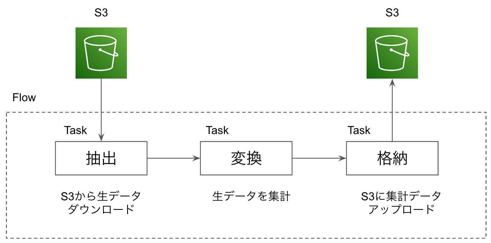

# Prefect2.0 ETL Workflow Example

[comment]: <> (![etl]&#40;./img/etl.png&#41;)

<p align="center">
  
</p>

Simple Python program that uses the Prefect library to create an ETL (Extract, Transform, Load) flow.   
- Downloads the raw data from an S3 bucket 
- Transformaes the raw data
- Uploads the transformed data back to the S3 bucke


## Requirement
```bash
python >= 3.8
prefect == 2.8.5
prefect-aws == 0.2.5
pandas == 1.5.1
s3fs
```

```bash
pip install -r requirements.txt
```

## Local Run
```python
python etl_flow.py
```

## Deployment
- Storage: S3
- Infrastructure: Docker Container

build deployment
```bash
prefect deployment build ./etl_flow.py:etl_flow
                         -n etl-flow
                         -sb s3/<your-s3-block>
                         -ib docker-container/<your-docker-block>
                         -q dev
                         -o deployment.yaml
```

apply deployment to Prefect UI
```bash
prefect deployment apply deployment.yaml
```
