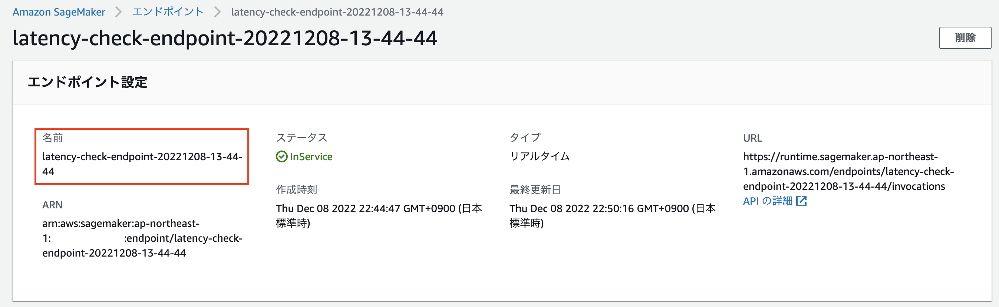

# SageMaker Endopoint Latency Measured by Locust
blog: 

Export envrionment variable for your endpoint name.  
In this example, the red circled line represents the endpoint name.

```bash
export ENDPONT_NAME=latency-check-endpoint-20221208-13-44-44
```


Run locust test
```bash
locust -f locust/locust_script.py -u 1 --headless --host="http://$ENDPOINT_NAME" --stop-timeout 60 -L DEBUG -t 3m --logfile=logfile.log --csv=locust.csv --csv-full-history --reset-stats
```